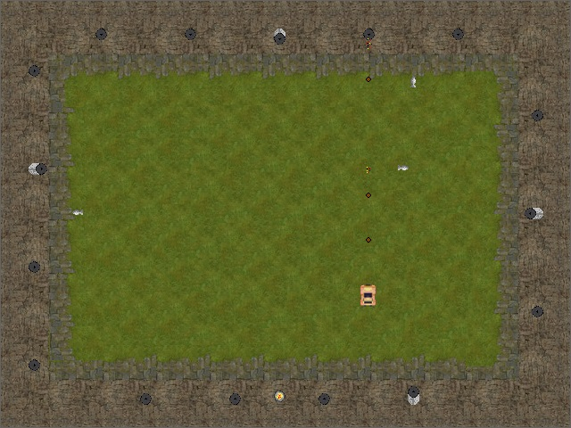

# Jais
One of my first big projects in C++ from a far past. A game where your task is to destroy all cannons around you and survive.

  
  

- Sources codes are in Czech/English language.
- Game should run on any reasonable version of Windows.

I made this game long time ago and I really can not remeber where I found assests what I am using. If you find anything what possibly violates copyright, please let me know.

For compilation, you will need `SDL` and `SDL_mixer` in some very archaic-I-cannot-remember versions :blush:

# Controls
- `Left/Right arrow` - direction change.
- `Up/Down arrow` - acceleration/break.
- `Ctrl` - shoot.

  
  

# Features
- Fully functional **Free ride** mode.
- The game is difficult, cannons are controled by random.
- The cannons are destroyable only when out of the wall.
- The game contains pickable bonuses.
- Original music made by Roman Antala.

# Screenshots

  
  

  

